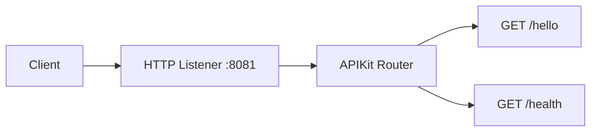

# Architecture

## Flow Diagram

## Connectors Used

| Connector | Version | Purpose |
|-----------|---------|----------|
| mule-http-connector | ${http.connector.version} | HTTP endpoints and requests |

## Configuration

*No configuration properties detected*

